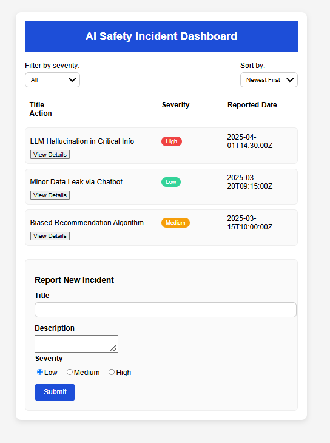
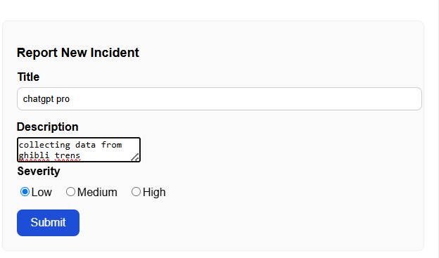
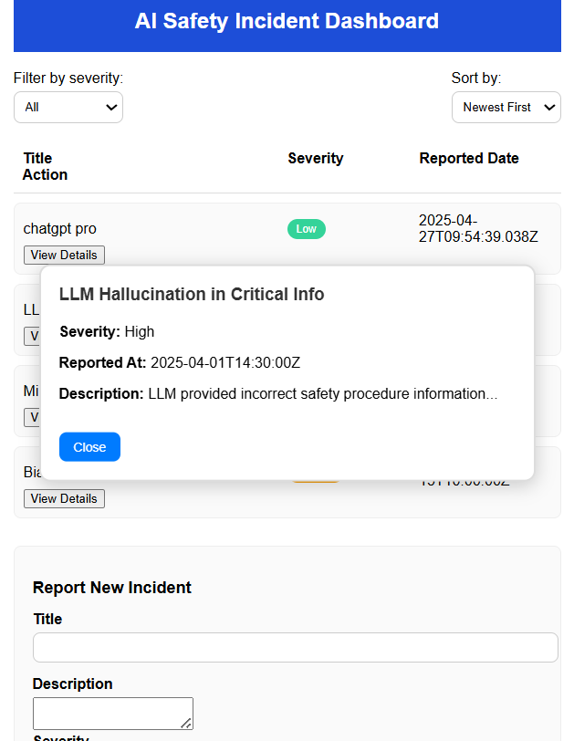

# 🛡️ AI Safety Incident Dashboard
https://ai-safety-dashboard-psi.vercel.app/

## Introduction

The **AI Safety Incident Dashboard** is a responsive and user-friendly React web application designed to track, report, and manage AI safety-related incidents.  
It allows users to view reported incidents, filter and sort them by severity and date, and report new incidents through a simple form.  
The application is completely frontend-based, with local state management using React's `useState` hook — making it ideal for demo purposes, educational showcases, or as a foundation for a larger system.

---

## 🚀 Features

- **Dashboard Overview**  
  Displays a list of AI safety incidents with:
  - Title
  - Severity (Low, Medium, High)
  - Reported Date
  - "View Details" button to toggle full description visibility.

- **Filtering and Sorting**  
  - Filter incidents by severity (All, Low, Medium, High).
  - Sort incidents by reported date (Newest First, Oldest First).

- **Report New Incident**  
  - Users can report a new incident by filling a simple form:
    - Title
    - Description
    - Severity (Low, Medium, High)
  - The new incident instantly appears in the dashboard.

- **Responsive Design**  
  - Fully responsive UI, working seamlessly on desktops, tablets, and mobile devices.
  - Clean, consistent styling using CSS.

- **State Management**  
  - All data is managed locally using React's `useState`.
  - No backend or database; data persists only during the current session.

- **Modular Components**  
  The app is cleanly organized into reusable React components:
  - `IncidentList`
  - `IncidentItem`
  - `NewIncidentForm`

---

## 🛠️ Technologies Used

- **React.js** (Functional components and hooks)
- **JavaScript (ES6+)**
- **HTML5**
- **CSS3**
- **Responsive Design** principles

---

## 📸 Screenshots

> _Here you can replace below placeholders with actual screenshots later._

| Dashboard View | New Incident Form | View Details Popup |
| :------------- | :----------------- | :----------------- |
|  |  |  |

---

## 📦 Installation

Follow these steps to run the project locally:

1. **Clone the repository**
   ```bash
   git clone https://github.com/your-username/ai-safety-incident-dashboard.git
   ```

2. **Navigate to the project directory**
   ```bash
   cd ai-safety-incident-dashboard
   ```

3. **Install dependencies**
   ```bash
   npm install
   ```

4. **Start the development server**
   ```bash
   npm start
   ```

5. **View in browser**
   Open [http://localhost:3000](http://localhost:3000) to see the app running!

---

## 📋 Usage

- View all reported incidents on the dashboard.
- Use the filter dropdown to display incidents by severity.
- Use the sort dropdown to change the order based on the reported date.
- Click on "View Details" to toggle the full description of any incident.
- Use the "Report New Incident" form to add a new incident dynamically.

---

## 📄 Project Structure

```
/src
  /components
    IncidentList.js
    IncidentItem.js
    NewIncidentForm.js
  App.js
  App.css
  index.js
```

- **IncidentList.js** — Renders the list of all incidents.
- **IncidentItem.js** — Represents a single incident item with details and toggle feature.
- **NewIncidentForm.js** — Form to report a new incident.
- **App.js** — Main entry file combining all components.
- **App.css** — Styling for all components.

---

## ✨ Future Improvements

- Persistent storage (localStorage or backend integration).
- Search functionality.
- Severity color coding improvements.
- Pagination for large datasets.

---

## 🙌 Acknowledgements

This project was built as part of a learning exercise to understand state management, component structuring, and building responsive interfaces with React.

---

## 📬 Contact

For any questions or feedback, feel free to reach out:

- Name: **[Raghav Gupta]**
- Email: **[raghavguptadanta@gmail.com]**
- LinkedIn: [https://www.linkedin.com/in/raghav-gupta2003/]

---
